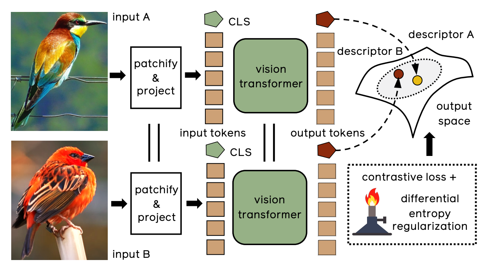

# Training Vision Transformers for Image Retrieval

- (Unofficial) PyTorch implementation of [Training Vision Transformers for Image Retrieval](https://arxiv.org/abs/2102.05644) (El-Nouby, Alaaeldin, et al. 2021).
- I have not yet achieved exactly the same results as reported in the paper (Differential entropy regularization does not have much effect on In-shop and SOP datasets).



## Steps to Run the Project

1. **Clone the Repository**:

   ```bash
   git clone git@github.com:HaykelBargouguy/Image_Retrieval_Transformers.git
   ```

2. **Create a Virtual Environment**:

   ```bash
   python -m venv venv
   ```

3. **Activate the Virtual Environment**:

   - On Windows:
     ```bash
     venv\Scripts\activate
     ```
   - On macOS/Linux:
     ```bash
     source venv/bin/activate
     ```

4. **Install the Required Packages**:

   ```bash
   pip install -r requirements1.txt
   ```

5. **Run the Training Script**:

   For example, to train on the CUB-200-2011 dataset:
   
   ```bash
   python main.py \
     --model deit_small_distilled_patch16_224 \
     --max-iter 2000 \
     --dataset cub200 \
     --data-path /data/CBIR_dataset \
     --rank 1 2 4 8 \
     --lambda-reg 0.7
   ```

6. **Get the Logs and Evaluation Results**:

   - After running the training, logs and evaluation results will be stored in the `/logs/` folder. Check this directory for detailed training and evaluation metrics.

## Training

- See `scripts/train.*.sh` for additional examples of training scripts.

### [CUB-200-2011](http://www.vision.caltech.edu/datasets/cub_200_2011/)
```bash
# CUB-200-2011
python main.py \
  --model deit_small_distilled_patch16_224 \
  --max-iter 2000 \
  --dataset cub200 \
  --data-path /data/CBIR_dataset \
  --rank 1 2 4 8 \
  --lambda-reg 0.7
```

## Experiments

> - IRT<sub>O</sub> – off-the-shelf extraction of features from a ViT backbone, pre-trained on ImageNet;
> - IRT<sub>L</sub> – fine-tuning a transformer with metric learning, in particular with a contrastive loss;
> - IRT<sub>R</sub> – additionally regularizing the output feature space to encourage uniformity.
> - †: Models pre-trained with distillation with a convnet trained on ImageNet1k

<table style="text-align: center">
 <tr>
  <td rowspan="2">Method</td>
  <td rowspan="2">Backbone</td>
  <td colspan="4"><a href="https://cvgl.stanford.edu/projects/lifted_struct/">SOP</a></td>
  <td colspan="4"><a href="http://www.vision.caltech.edu/datasets/cub_200_2011/">CUB-200</a></td>
  <td colspan="4"><a href="https://mmlab.ie.cuhk.edu.hk/projects/DeepFashion/InShopRetrieval.html">In-Shop</a></td>
 </tr>
 <tr>
  <td>1</td>
  <td>10</td>
  <td>100</td>
  <td>1000</td>
  <td>1</td>
  <td>2</td>
  <td>4</td>
  <td>8</td>
  <td>1</td>
  <td>10</td>
  <td>20</td>
  <td>30</td>
 </tr>
 <tr>
  <td>IRT<sub>O</sub></td>
  <td>DeiT-S</td>
  <td>53.12</td>
  <td>68.96</td>
  <td>81.60</td>
  <td>94.09</td>
  <td>58.68</td>
  <td>71.30</td>
  <td>80.96</td>
  <td>88.18</td>
  <td>31.28</td>
  <td>57.03</td>
  <td>64.20</td>
  <td>68.28</td>
 </tr>
 <tr>
  <td>IRT<sub>L</sub></td>
  <td>DeiT-S</td>
  <td>83.56</td>
  <td>93.29</td>
  <td>97.23</td>
  <td>99.03</td>
  <td>73.68</td>
  <td>82.58</td>
  <td>88.77</td>
  <td>92.71</td>
  <td>93.09</td>
  <td>98.28</td>
  <td>98.74</td>
  <td>99.02</td>
 </tr>
 <tr>
  <td>IRT<sub>R</sub></td>
  <td>DeiT-S</td>
  <td>82.67</td>
  <td>92.73</td>
  <td>96.69</td>
  <td>98.80</td>
  <td>73.73</td>
  <td>82.91</td>
  <td>89.30</td>
  <td>93.35</td>
  <td>90.47</td>
  <td>97.97</td>
  <td>98.61</td>
  <td>98.92</td>
 </tr>
 <tr>
  <td>IRT<sub>R</sub></td>
  <td>DeiT-S†</td>
  <td>82.70</td>
  <td>92.85</td>
  <td>96.92</td>
  <td>98.86</td>
  <td>76.55</td>
  <td>85.26</td>
  <td>90.92</td>
  <td>94.65</td>
  <td>90.66</td>
  <td>98.16</td>
  <td>98.68</td>
  <td>98.99</td>
 </tr>
</table>

## References

- El-Nouby, Alaaeldin, et al. "Training vision transformers for image retrieval." arXiv preprint arXiv:2102.05644 (2021).

